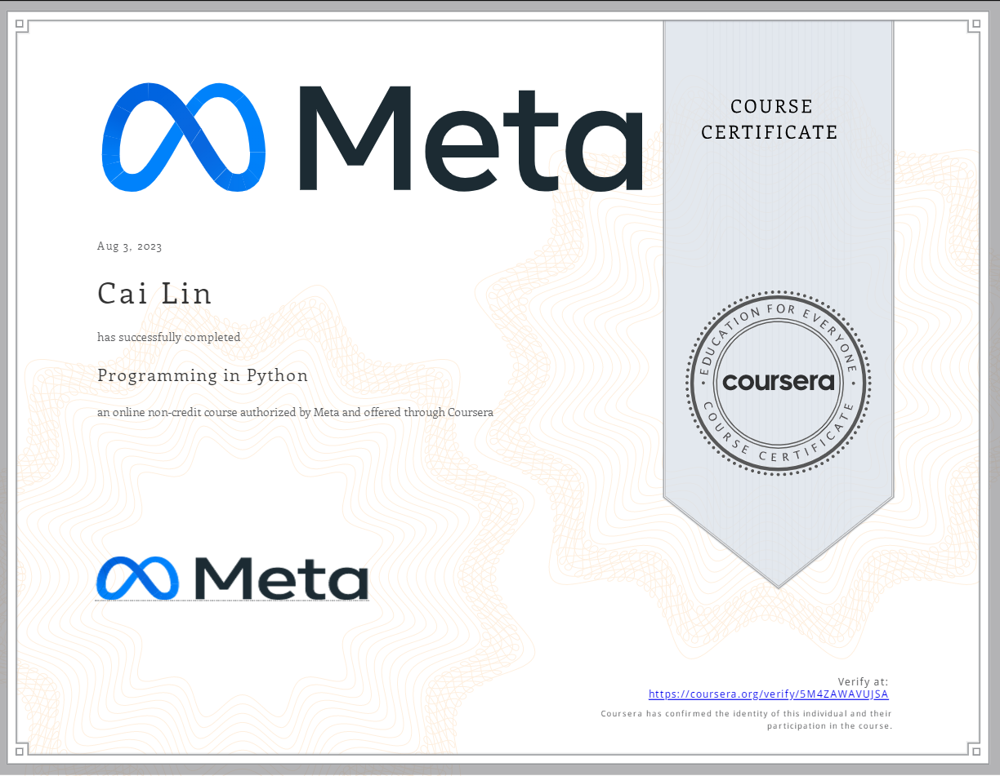

# Programming in Python

- This directory contains all of my assignments from the Coursera Course: [Programming in Python](https://www.coursera.org/learn/programming-in-python?specialization=meta-back-end-developer)

## Table of Content

- Week 1: [Getting started with Python](https://github.com/kai-ion/Meta-Back-End-Developer/tree/main/Course%202%20-%20Programming%20in%20Python/Week%201%20-%20Getting%20started%20with%20Python)

  - [Cheat sheets and readings](https://github.com/kai-ion/Meta-Back-End-Developer/tree/main/Course%202%20-%20Programming%20in%20Python/Week%201%20-%20Getting%20started%20with%20Python/1.cheat-sheets-readings)
  - [Knowledge check and quizzes](https://github.com/kai-ion/Meta-Back-End-Developer/tree/main/Course%202%20-%20Programming%20in%20Python/Week%201%20-%20Getting%20started%20with%20Python/2.knowledge-checks%20and%20quizzes)
  - [Programming assignments and exercises](https://github.com/kai-ion/Meta-Back-End-Developer/tree/main/Course%202%20-%20Programming%20in%20Python/Week%201%20-%20Getting%20started%20with%20Python/3.programming-assignment-exercises)

- Week 2: [Basic Programming with Python](https://github.com/kai-ion/Meta-Back-End-Developer/tree/main/Course%202%20-%20Programming%20in%20Python/Week%202%20-%20Basic%20Programming%20with%20Python)

  - [Knowledge check and quizzes](https://github.com/kai-ion/Meta-Back-End-Developer/tree/main/Course%202%20-%20Programming%20in%20Python/Week%202%20-%20Basic%20Programming%20with%20Python/1.knowledge-checks-and-quizzes)
  - [Programming assignments and exercises](https://github.com/kai-ion/Meta-Back-End-Developer/tree/main/Course%202%20-%20Programming%20in%20Python/Week%202%20-%20Basic%20Programming%20with%20Python/2.programming-assignments-exercises)

- Week 3: [Programming paradigms](https://github.com/kai-ion/Meta-Back-End-Developer/tree/main/Course%202%20-%20Programming%20in%20Python/Week%203%20-%20Programming%20paradigms)

  - [Cheat sheets and readings](https://github.com/kai-ion/Meta-Back-End-Developer/tree/main/Course%202%20-%20Programming%20in%20Python/Week%203%20-%20Programming%20paradigms/1.cheat-sheets-reading)
  - [Knowledge check and quizzes](https://github.com/kai-ion/Meta-Back-End-Developer/tree/main/Course%202%20-%20Programming%20in%20Python/Week%203%20-%20Programming%20paradigms/2.knowledge-checks-quizzes)
  - [Programming assignments and exercises](https://github.com/kai-ion/Meta-Back-End-Developer/tree/main/Course%202%20-%20Programming%20in%20Python/Week%203%20-%20Programming%20paradigms/3.programming-assignment-exercises)

- Week 4: [Modules, packages, libraries and tools](https://github.com/kai-ion/Meta-Back-End-Developer/tree/main/Course%202%20-%20Programming%20in%20Python/Week%204%20-%20Modules%2C%20packages%2C%20libraries%20and%20tools)

  - [Cheat sheets and readings](https://github.com/kai-ion/Meta-Back-End-Developer/tree/main/Course%202%20-%20Programming%20in%20Python/Week%204%20-%20Modules%2C%20packages%2C%20libraries%20and%20tools/1.cheat-sheets-reading)
  - [Knowledge check and quizzes](https://github.com/kai-ion/Meta-Back-End-Developer/tree/main/Course%202%20-%20Programming%20in%20Python/Week%204%20-%20Modules%2C%20packages%2C%20libraries%20and%20tools/2.knowledge-checks-quizzes)
  - [Programming assignments](https://github.com/kai-ion/Meta-Back-End-Developer/tree/main/Course%202%20-%20Programming%20in%20Python/Week%204%20-%20Modules%2C%20packages%2C%20libraries%20and%20tools/3.programming-assignment)

- Week 5: [End-of-Course Graded Assessment](https://github.com/kai-ion/Meta-Back-End-Developer/tree/main/Course%202%20-%20Programming%20in%20Python/Week%205%20-%20End-of-Course%20Graded%20Assessment)

## Proof of Completion

