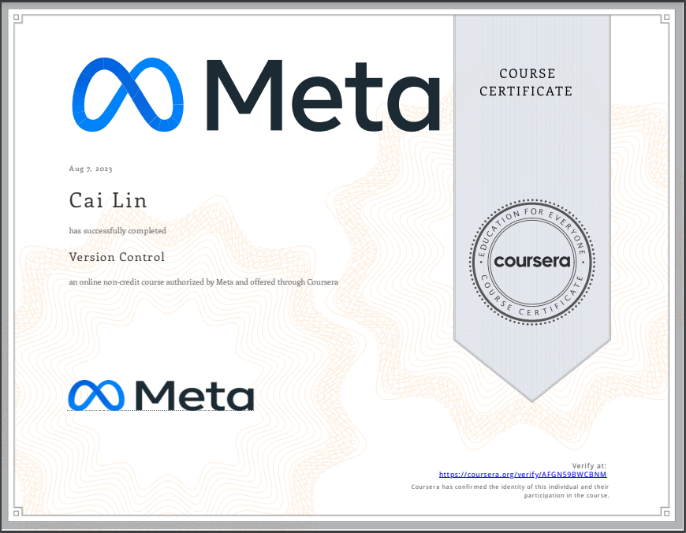

# Version Control

- This directory contains all of my assignments from the Coursera Course: [Version Control](https://www.coursera.org/learn/introduction-to-version-control?specialization=meta-front-end-developer)

## Table of Content

- Week 1: [Software collaboration]()
- Week 2: [Command Line]()
- Week 3: [Working with Git]()
- Week 4: [Graded Assessment]()

## Proof of Completion

